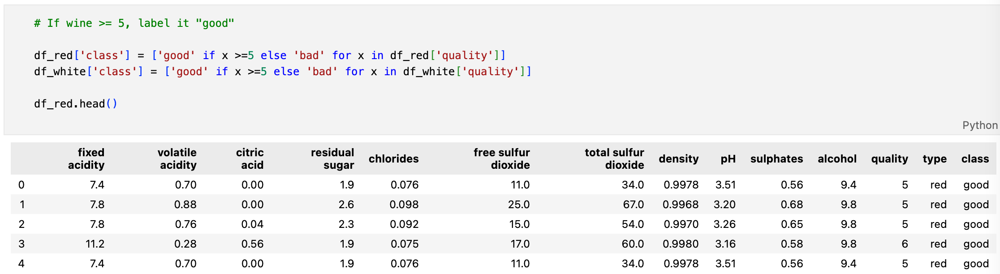
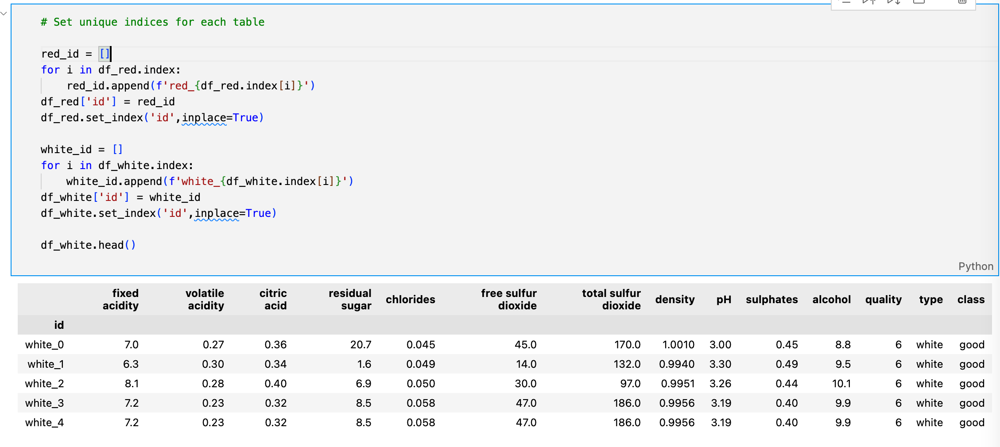
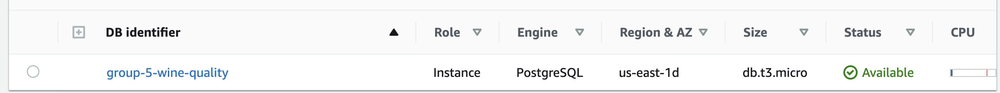
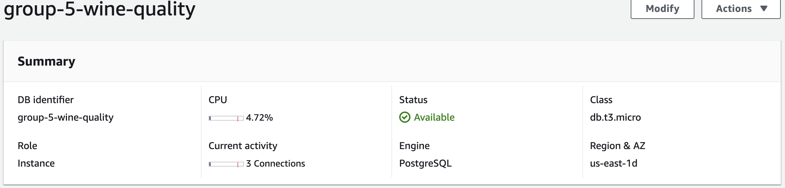
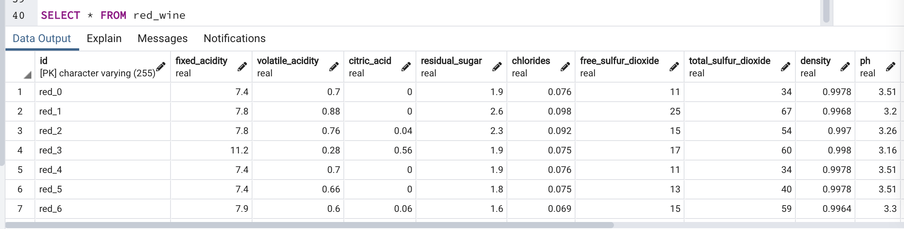

# Wine Quality Analysis

For this project we aim to assess wine quality, and whether it is possible to classify a wine based on its chemical properties.

## Sources

The data sources used for this analysis were pulled from UCI's machine learning repository, donated by Paulo Cortez of the University of Minho, Portugal (P. Cortez, A. Cerdeira, F. Almeida, T. Matos and J. Reis).
- **Wine Quality Datasets** [(view)](http://www3.dsi.uminho.pt/pcortez/wine/)

The data relates to red and white Vinho Verde wine samples, and their physicochemical properties.

## EDA

<details>
    <summary>Click here to expand...</summary>

The dataset was originally in the form of two CSV's - one for red wine, one for white:


The data types were assessed, in addition to checking for Null/NA values.


The distribution of wine quality was assessed by creating a new dataframe using normalized value counts (quality scores represented as percentages of total wine counts).

```python
# Count number of values per score, per wine type (normalize creates a percent of total value)
red_quality = df_red['quality'].value_counts(normalize=True)
white_quality = df_white['quality'].value_counts(normalize=True)

# Create emplty DF for both wine types, and quality scores from 1 to 10
quality_perc = pd.DataFrame(columns=('Red','White'),index=list(range(1,11)))

# Input quality counts to DF
quality_perc['Red'] = red_quality
quality_perc['White'] = white_quality

# Fill blanks with 0's
quality_perc.fillna(0,inplace=True)
```


  
</details>
  
## Database

To create the database, the individual CSVs needed to be pre-processed. 

1. Data cleaned (mirroring work done in the Machine Learning step)
2. Quality classified (wine scoring '5' or better is classified as 'good')
3. A unique index created that would remain unique once both tables are combined (see below)


Classification added


Unique index created with prefix for the wine type

From here, an Amazon AWS database was built, and manipulated via pgAdmin using PostGresSQL





The schema was established:
```sql
DROP TABLE IF EXISTS red_wine;
DROP TABLE IF EXISTS white_wine;  

CREATE TABLE red_wine (
  id VARCHAR(255) PRIMARY KEY NOT NULL,
  fixed_acidity REAL,
  volatile_acidity REAL,
  citric_acid REAL,
  residual_sugar REAL,
  chlorides REAL,
  free_sulfur_dioxide REAL,
  total_sulfur_dioxide REAL,
  density REAL,
  pH REAL,
  sulphates REAL,
  alcohol REAL,
  quality INT ,
  type VARCHAR(255) ,
  class VARCHAR(255) 
);

CREATE TABLE white_wine (
  id VARCHAR(255) PRIMARY KEY NOT NULL,
  fixed_acidity REAL,
  volatile_acidity REAL,
  citric_acid REAL,
  residual_sugar REAL,
  chlorides REAL,
  free_sulfur_dioxide REAL,
  total_sulfur_dioxide REAL,
  density REAL,
  pH REAL,
  sulphates REAL,
  alcohol REAL,
  quality INT ,
  type VARCHAR(255) ,
  class VARCHAR(255) 
);
```


Finally, the data was combined

```sql
DROP TABLE IF EXISTS combined;

SELECT * INTO combined FROM red_wine
UNION
SELECT * FROM white_wine;

SELECT * FROM combined;
```


## Model

For this project we will use Ensemble Learners to predict the wine classification, as well as determining feature importance to assess which feature is more responsible for determining quality.


1. Read in CSV and view data set
 Markup : * Bullet list
              * Nested bullet
                  * Sub-nested bullet etc
          * Bullet list item 2
2. Data Cleaning    
Compile Null Lists
-There are no null values in the given data set
    * Missing Data Check
        -There is no missing data
    * Create DF with lists
    * Set Index


    * Quality Score Distribution
    * Fill Blanks with 0


    * Visualization of Distribution of Wine Quality Scores by Type

        - Red wine max quality score was 8, while White wine maxed at 9
  
    * Set Classification Column (If wine is greater 5 its "good")

        - Distribution is relatively even across both wines, with most wines scoring 5's and 6's.However, when it is too balanced it ends up giving us the perfect model. The first classification was set at 7 and gave an accuracy of 100%. By moving the threshold to 5 we can get a more realiable model. 
     
    * Combine Dataframes
    
 
        - The number of rows before merging was 1599 and the number of rows after merging was 6497. The columns remained at 14.

3. Data Exploration
    * Counts
    * Averages 

  
    * Created Dummy Variable for Strings "Type" and "Class"
    
    
    
    * Outliers


        - This step helps us to identify mean, median, min, max and percentages(25,50,75) of feature attributes.
        - 75% of the data has an alcohol percentage of 14.9
        - Minimum value of sulphates is .22 and maximum of 2
        
    * Bar Graphs 


    * Boxplot

        - There are alot of outliers in almost every category


    * Scatter


        - We are able to see how the different values are correlated with each other or not
        - Total sulfur and sulfur have a slight linear relationship as the data skews right
        - Most of the data shows there isnt a visable linear relationship 
        
    * Heatmap


        - The higher values are the darker shades and the less are the lighter shades
        - From the above chart we can see that free sulfur dioxide, total sulfer dioxide, and type have the highest values 
        - From the chart we can also see that the alcohol, density and volatile acidity have the lowest values
        
4. Split into Training and Testing
    * Defined Features 
    * Partitioned Data

        - Partition data into training (80%) and testing (20%)
        - Trained on 80 and tested on 20
        
5. Models
    * Logistic Regression

        - Accuracy score of .96184
  
    * Random Forrest

        - The features of the most importance are free sulfer dioxide, volatile acidity, total sulfur dioxide. 
        - The features of the least importance are fixed acidity, alcohol, or type. 

    * Linear Regression

    
   
## The Question(s)

This project will aim to determine the following:
1. Is a "Good" wine able to be predicted via the analysis of a wine's physicochemical properties? 
2. What physicochemical features are most responsible for determining wine quality?
3. Can a wine quality evaluation be conducted agnostic of wine type (red or white), or do such evaluations need to remain segregated by type?

## The Presentation / Dashboard

[Google Slides: Machine Learning, with Wine](https://docs.google.com/presentation/d/e/2PACX-1vTqoan2hVpKwoYIjAuQ4W-HpfsUVRlLGqymMuUIjRB6PQTaazfvCgaU0s7ISnSQ8RkUpHCy7jH6RrF8/pub?start=false&loop=false&delayms=50000)


