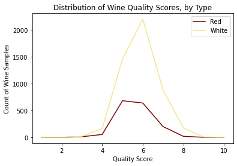

# Wine Quality Analysis

For this project we aim to assess wine quality, and whether it is possible to classify a wine based on its chemical properties.

## Sources

The data sources used for this analysis were pulled from UCI's machine learning repository, donated by Paulo Cortez of the University of Minho, Portugal (P. Cortez, A. Cerdeira, F. Almeida, T. Matos and J. Reis).
- **Wine Quality Datasets** [(view)](http://www3.dsi.uminho.pt/pcortez/wine/)

The data relates to red and white Vinho Verde wine samples, and their physicochemical properties.

## EDA

<details>
    <summary>Click here to expand...</summary>

The dataset was originally in the form of two CSV's - one for red wine, one for white:


The data types were assessed, in addition to checking for Null/NA values.


The distribution of wine quality was assessed by creating a new dataframe using normalized value counts (quality scores represented as percentages of total wine counts).

```python
# Count number of values per score, per wine type (normalize creates a percent of total value)
red_quality = df_red['quality'].value_counts(normalize=True)
white_quality = df_white['quality'].value_counts(normalize=True)

# Create emplty DF for both wine types, and quality scores from 1 to 10
quality_perc = pd.DataFrame(columns=('Red','White'),index=list(range(1,11)))

# Input quality counts to DF
quality_perc['Red'] = red_quality
quality_perc['White'] = white_quality

# Fill blanks with 0's
quality_perc.fillna(0,inplace=True)
```




### Takeaways

- Distribution is relatively even across both wines, with most wines scoring 5's and 6's
- Red wine max quality score was 8, while White wine maxed at 9
- A "good" wine score higher than 7 will yield very few wines - therefore, "good" classification is best set at 7, for the purposes of this analysis. 


  
</details>
  
## Database

To create the database, the individual CSVs needed to be pre-processed. 

1. Data cleaned (mirroring work done in the Machine Learning step)
2. Quality classified (wine scoring '5' or better is classified as 'good')
3. A unique index created that would remain unique once both tables are combined (see below)


Classification added


Unique index created with prefix for the wine type

From here, an Amazon AWS database was built, and manipulated via pgAdmin using PostGresSQL


The schema was established:
```sql
DROP TABLE IF EXISTS red_wine;
DROP TABLE IF EXISTS white_wine;  

CREATE TABLE red_wine (
  id VARCHAR(255) PRIMARY KEY NOT NULL,
  fixed_acidity REAL,
  volatile_acidity REAL,
  citric_acid REAL,
  residual_sugar REAL,
  chlorides REAL,
  free_sulfur_dioxide REAL,
  total_sulfur_dioxide REAL,
  density REAL,
  pH REAL,
  sulphates REAL,
  alcohol REAL,
  quality INT ,
  type VARCHAR(255) ,
  class VARCHAR(255) 
);

CREATE TABLE white_wine (
  id VARCHAR(255) PRIMARY KEY NOT NULL,
  fixed_acidity REAL,
  volatile_acidity REAL,
  citric_acid REAL,
  residual_sugar REAL,
  chlorides REAL,
  free_sulfur_dioxide REAL,
  total_sulfur_dioxide REAL,
  density REAL,
  pH REAL,
  sulphates REAL,
  alcohol REAL,
  quality INT ,
  type VARCHAR(255) ,
  class VARCHAR(255) 
);
```


Finally, the data was combined

```sql
DROP TABLE IF EXISTS combined;

SELECT * INTO combined FROM red_wine
UNION
SELECT * FROM white_wine;

SELECT * FROM combined;
```


## Model

For this project we will use Ensemble Learners to predict the wine classification, as well as determining feature importance to assess which feature is more responsible for determining quality.

Steps Taken for ML Mockup

1. Read in CSV
2. Data Cleaning    
    * Compile Null Lists
    * Missing Data Check
    * Create DF with lists
    * Set Index
    * Quality Score Distribution
    * Fill Blanks with 0
    * Visualization of Distribution of Wine Quality Scores by Type
    * Set Classification Column (If wine is greater 7 its "good")
    * Combine Dataframes
3. Data Exploration 
    * Counts
    * Averages 
    * Created Dummy Variable for Strings "Type" and "Class"
    * Outliers
    * Bar Graphs 
    * Boxplot
    * Scatter
    * Heatmap
4. Split into Training and Testing
    * Defined Features 
    * Partitioned Data
5. Models
    * Over & Sampling
    * Random Forrest
    * Logistic Regression
    
   
## The Question(s)

This project will aim to determine the following:
1. Is a "Good" wine able to be predicted via the analysis of a wine's physicochemical properties? 
2. What physicochemical features are most responsible for determining wine quality?
3. Can a wine quality evaluation be conducted agnostic of wine type (red or white), or do such evaluations need to remain segregated by type?

## The Presentation / Dashboard

[Google Slides: Machine Learning, with Wine](https://docs.google.com/presentation/d/e/2PACX-1vTqoan2hVpKwoYIjAuQ4W-HpfsUVRlLGqymMuUIjRB6PQTaazfvCgaU0s7ISnSQ8RkUpHCy7jH6RrF8/pub?start=false&loop=false&delayms=50000)


