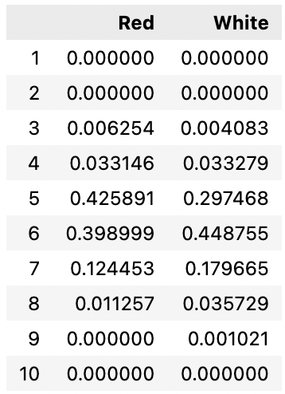

# Wine Quality Analysis

For this project we aim to assess wine quality, and whether it is possible to classify a wine based on its chemical properties.

## Sources

The data sources used for this analysis were pulled from UCI's machine learning repository, donated by Paulo Cortez of the University of Minho, Portugal (P. Cortez, A. Cerdeira, F. Almeida, T. Matos and J. Reis).
- **Wine Quality Datasets** [(view)](http://www3.dsi.uminho.pt/pcortez/wine/)

The data relates to red and white Vinho Verde wine samples, and their physicochemical properties.

## EDA

<details>
    <summary>Click here to expand...</summary>

The dataset was originally in the form of two CSV's - one for red wine, one for white:


The data types were assessed, in addition to checking for Null/NA values.


The distribution of wine quality was assessed by creating a new dataframe using normalized value counts (quality scores represented as percentages of total wine counts).

```python
# Count number of values per score, per wine type (normalize creates a percent of total value)
red_quality = df_red['quality'].value_counts(normalize=True)
white_quality = df_white['quality'].value_counts(normalize=True)

# Create emplty DF for both wine types, and quality scores from 1 to 10
quality_perc = pd.DataFrame(columns=('Red','White'),index=list(range(1,11)))

# Input quality counts to DF
quality_perc['Red'] = red_quality
quality_perc['White'] = white_quality

# Fill blanks with 0's
quality_perc.fillna(0,inplace=True)
```




### Takeaways

- Distribution is relatively even across both wines, with most wines scoring 5's and 6's
- Red wine max quality score was 8, while White wine maxed at 9
- A "good" wine score higher than 7 will yield very few wines - therefore, "good" classification is best set at 7, for the purposes of this analysis. 


  
</details>
To clean this dataset we will:
- Check for null values
- Check data types
- Append a wine type to each dataset (red / white)
- Append a column for wine classification (binary, good / bad based on a certain quality threshold)
- Create a union of both tables to conduct testing across both datasets.
  
## Database
- Use QuickDB to draft up the database structure
- Use Postgres for the database


## Model

For this project we will use Ensemble Learners to predict the wine classification, as well as determining feature importance to assess which feature is more responsible for determining quality.

## The Question(s)

This project will aim to determine the following:
1. Is a "Good" wine able to be predicted via the analysis of a wine's physicochemical properties? 
2. What physicochemical features are most responsible for determining wine quality?
3. Can a wine quality evaluation be conducted agnostic of wine type (red or white), or do such evaluations need to remain segregated by type?